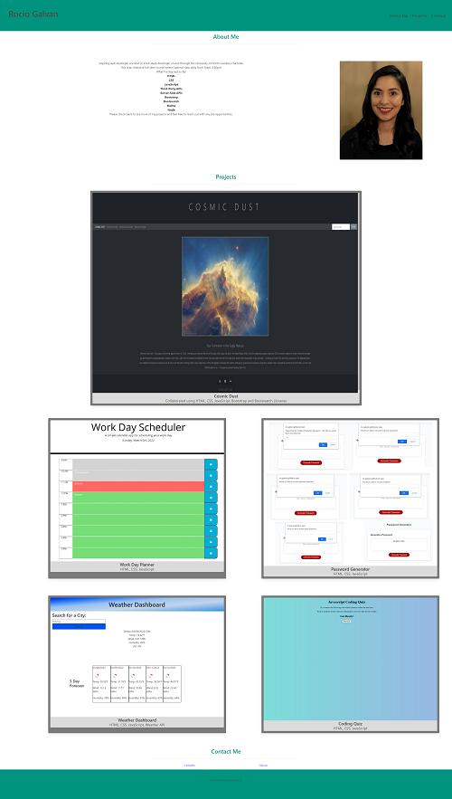

# portfolio

[link to live website](https://ro-galvan.github.io/portfolio/)

[link to GitHub repository](https://github.com/Ro-Galvan/portfolio)

# Description

I wanted to challenge myself and start my portfolio over again. This time I used Bulma library and did all the styling in HTML as a result of that.

Check out my old porfolio:

[link to live website](https://ro-galvan.github.io/rocio-galvan-portfolio/)

[link to GitHub repository](https://github.com/Ro-Galvan/rocio-galvan-portfolio)

# Visual

